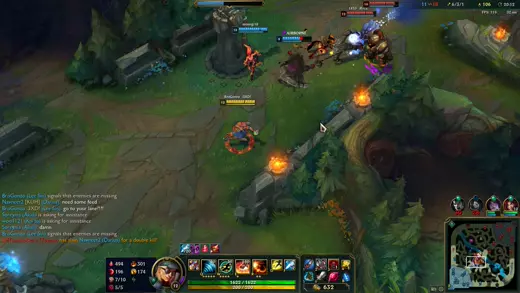
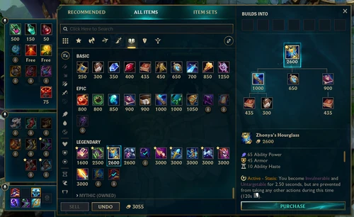
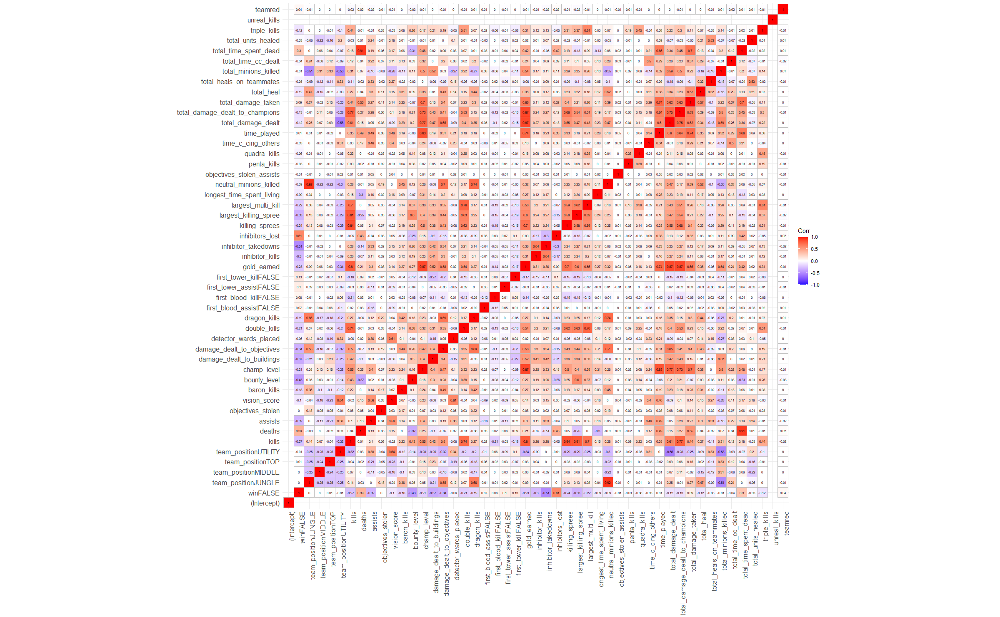

# Introduction

The project will train a model that will predict the win rate of a League of Legends game.

## What is League of Legends?

League of Legends, also known as League, is a multiplayer online battle arena video game.


In a normal game, 10 players with similar expertise (determined by ranking and level system) will be divided into two teams. Each player will select their own champions to control. In most of the times, each champion will have an "auto attack" action and a unique set of 4 abilities which are acquired during leveling and mapped to a key on the keyboard. The combinations of auto-attack and abilities can damage the opponents, heals allies, improve self status and do a lot more things.



The power of abilities can be further improved by purchasing item with gold you mostly earned from killing opponents ,minions, neutral entities and destroying buildings.



## How to win the game?

Destroying the base (aka the Nexus).


However, each base is heavily guarded by 11 turrets from 3 directions and you cannot deal damage to the base unless you've destroyed at least 5 of the turrets. These turrets deal massive amount of damage to opponents champions and minions when they're in-range.

{width="150"}

Each base also generates minions. Minions will head for the opponents base and dealing damage to the opponent's minions and buildings along the path.

Opponents team will also protects their turrets and bases by dealing damage to you. So you should probably send the champion to revive in base by killing them, or dealing enough damage so they will stay away from you.

## Maximizing your chance to win.

The designed path to win is the following

1.  Leveling up and earn gold by killing minion or neutral entities
2.  Buy items to increase your damage or defense.
3.  Kill the opponent champions
4.  Dealing damage to turrets until destroyed
5.  Repeat step 1-4 and step 1-3 can be done in a random order.

It is also worth lists some beliefs I have about what contributes most to the winning rate, so I could test them using the model.

-   Player should maximize champion kill to win the game since kill a champion gives most gold
-   Player first kill is gonna influence the win rate, since it rewards with a bonus gold and helps with scaling
-   Vision score is very important to win rate, since having vision all over the maps avoid being ambushed
-   Stealing objectives from the opponents team will hurt their morale and make them prone to mistakes.

# The current model

The above steps are the simplification of the game design and mechanics. In fact, there's a lot of things you can do to improve your win rate by design, such as stealing neutral entities, placing vision ward or sacrifice for your teammates by taking damage for them. Besides predictions, the model will try to find out which components have the largest impact on the win rate and thus needs be prioritized during strategy-making.

## Dataset

The dataset was downloaded from [Kaggle](https://www.kaggle.com/datasets/junhachoi/all-ranked-solo-games-on-kr-server-24-hours?select=sat+df.csv), which records ranking games that created in one day from the Korean server.

> It's a huge dataset with 2,500,000 observations, even though it might be beneficial to include all the data. The fact is that R runs really slow, especially if I picked more than 20 predictors and use models with high time complexity like randomForest or SVM with regularizations, and my computer always crash when the `fit` function generate matrices that are over 20GB. As a results, I'm only only use 10000 observations.

## The workflow

1.  Clean data by removing invalid rows and factoring certain predictors
2.  Exploratory data analysis to remove certain predictors
3.  Split data and make cross validation
4.  Build logistic regression, linear discriminant analysis, quadratic discriminant analysis, random forests
5.  Evaluate accuracy of the model

# Load all the package

```{r}
suppressPackageStartupMessages(library(tidyverse))
suppressPackageStartupMessages(library(tidymodels))
suppressPackageStartupMessages(library(corrplot))
suppressPackageStartupMessages(library(discrim))
suppressPackageStartupMessages(library(poissonreg))
suppressPackageStartupMessages(library(corrr))
suppressPackageStartupMessages(library(klaR))
suppressPackageStartupMessages(library(vroom))
suppressPackageStartupMessages(library(MASS))
suppressPackageStartupMessages(library(janitor))
suppressPackageStartupMessages(library(ggcorrplot))
suppressPackageStartupMessages(library(vip))
suppressPackageStartupMessages(library(ranger))
suppressPackageStartupMessages(library(kernlab))
suppressPackageStartupMessages(library(splitstackshape))
suppressPackageStartupMessages(library(xgboost))
tidymodels_prefer()
```

# Cleaning and manipulation

## Fix Encoding

As the author of the dataset suggests, the original encoding is `cp949` (One type of Korean character encoding). So it is wise to convert it to UTF-8 first to avoid encoding issue

Here I use the `iconv` command line tool to change the encoding

``` bash
iconv -f cp949 -t utf-8 league_data.csv > league_data_utf8.csv
```

## Loading the dataset

```{r warning=FALSE}

league_all_df <- clean_names(vroom("dataset/league_data_utf8.csv"))

```

```{r}
# Drop variables that are not needed
league_all_df <- league_all_df %>%
    select(
        -c(summoner_name,
        puuid,
        summoner_id,
        creation_time,
        participant_id,
        ))
```

## Remove invalid games

Remove rows that contains values that do not match the column types

Remake can be made under 3 minutes if one or more player is disconnected from the game in the first 1:30 minutes - these game will not provide meaningful information to the model - however, the game can still run for a period of time after remake voting is passed - so to be safe, use 5 minutes as boundary

```{r}
for (col in colnames(league_all_df)) {
    if (is.character(league_all_df[[col]])) {
        print(unique(league_all_df[,col]))
    }
}
# league_all_df <- 
league_all_df <- league_all_df %>%
    filter(time_played > 360) %>% 
    filter(win %in% c("True", "False")) %>% 
    filter(team_position %in% c("TOP", "JUNGLE", "MIDDLE", "BOTTOM", "UTILITY")) %>% 
    filter(first_tower_kill %in% c("True", "False"))
    
# Fixing vroom type import issue
league_all_df$win <- as.logical(league_all_df$win)
league_all_df$first_tower_kill <- as.logical(league_all_df$first_tower_kill)
league_all_df$vision_score <- as.numeric(league_all_df$vision_score)
league_all_df$champ_level <- as.numeric(league_all_df$champ_level)
league_all_df$dragon_kills <- as.numeric(league_all_df$dragon_kills)

```

Remove NAs - listing column containing NA - remove rows containing NA

```{r}
# Get columns with na values
na_columns <- names(which(colSums(is.na(league_all_df)) > 0))
print(na_columns)

# Loop through the columns and filter out not na rows
for (col in na_columns) {
    league_all_df <- league_all_df %>%
        filter(!is.na({{col}}))
}

```

Take 10000 observations but stratified on win

```{r}

league_all_df <- stratified(league_all_df, "win", 10000)
```

## Conversion and Factor

```{r}

league_all_df <- league_all_df %>%
    mutate(team = case_when(
        team_id == "100" ~ "blue",
        team_id == "200" ~ "red",
    ))
```

Convert appropriate predictors to factor

```{r}
str(league_all_df)
league_all_df_factored <- league_all_df %>%
    mutate(
        across(
            c(
                win,
                team_position,
                first_blood_kill,
                first_blood_assist,
                first_tower_kill,
                first_tower_assist,
                team,
                champion_name),
            as.factor)
    )
```

```{r}
# Releveling
league_all_df_factored <- league_all_df_factored %>%
    mutate(across(
            c(
                win,
                first_blood_kill,
                first_blood_assist,
                first_tower_kill,
                first_tower_assist,
            ),
            ~fct_relevel(., c("TRUE", "FALSE"))))
```

# EDA

Now I will start the exploratory data analysis. First, I will have the correlation matrix prepared by dummying several factorized predictors

## The correlation matrix

```{r}
print(colnames(league_all_df_factored))


# Plot correlation matrix
league_df_eda <- select(league_all_df_factored, -c(no, game_no, player_no, korean_time, team_id, champion_name, game_ended_in_early_surrender, game_ended_in_surrender, team_early_surrendered))
correlations <- model.matrix(~., data = league_df_eda) %>% 
    cor(use='complete.obs')
```

```{r eval=FALSE}
correlations %>% 
    ggcorrplot(show.diag = T, type="full", lab=TRUE, lab_size = 2, tl.srt = 90)
```



The correlation matrix highlights many predictors that are correlated with losing the game. However, these predictors can be highly co-linear because some of them are calculated based on the other predictor. To avoid co-linearity reduce the interpretability of the model, it is necessary to choose a predictor that can capture the essence and remove the redundant predictors.

Thus, the following predictors will be disregarded with reason

1.  double_kill, triple_kill, quadra_kill, penta_kill, killing_spree, largest_killing_spree, unreal kill: these predictors are highly correlated with each others, and they are also highly correlated with the kill, gold, total_damage_dealt which are our predictors of interest.
2.  total_damage_dealt: it's simply total_damage_dealt_to_champion + damage to non champion (which can be inferred from neutral_minions_killed, dragon_kills and so on), it is collinear with total_damage_dealt_to_champion and thus needs to be removed
3.  total_time_spent_dead: it's summation from 1 to deaths of death time at specific level
4.  gold_earned: this is a value calculated by summation over all the kills, assist, building destroyed, but I'm interested in it's components

The final lists of variables becomes

| Variable                        | Explanation                                                                                               |
|------------------------|-----------------------------------------------|
| kills                           | The number of opponent champion player kills                                                              |
| assists                         | The number of opponent champion kill player assisted                                                      |
| deaths                          | The number of times player has been killed                                                                |
| champ_level                     | The level of champion when the game ends                                                                  |
| bounty_level                    | The level of bounty of a player, higher bounty gives opponent more gold if successfully killed the player |
| objectives_stolen               | The number of dragon, rift herald and baron stolen                                                        |
| objectives_stolen_assist        | The number of dragon, rift herald and baron stolen assist                                                 |
| vision_score                    | The amount of vision score player get from placing and countering opponent ward                           |
| damage_dealt_to_buildings       | Damage dealt to to turrets and inhibitors                                                                 |
| first_blood_assist              | If the player assist teammate in getting the first blood                                                  |
| first_blood_kill                | If the player get the first blood kill                                                                    |
| fist_tower_assist               | If the player assist teammate in getting the first tower                                                  |
| fist_tower_kill                 | If the player getting the first tower                                                                     |
| inhibitor_takedowns             | The number of inhibitor destruction player participated in                                                |
| inhibitor_lost                  | the number of inhibitor lost as a team                                                                    |
| longest_time_spend_living       | longest time player lived before between consecutive death                                                |
| neutral_minion_killed           | jungle monster killed                                                                                     |
| time_c\_cing_others             | total time of crowd control cast on opponent champions                                                    |
| total_damage_dealt_to_champions | total amount of damage dealt to opponent champions                                                        |
| total_damage_taken              | total damage receives from opponent champion                                                              |
| total_heal                      | total healing received or self-casted                                                                     |
| total_heals_on_teammates        | total healing cast on teammates                                                                           |
| total_minion_killed             | total minion killed                                                                                       |
| dragon_kills                    | The number of dragon player kills                                                                         |
| baron_kills                     | The number of baron player kills                                                                          |
| team                            | either blue or red team                                                                                   |

And an few interaction to capture the enhancement effect of certain predictors - kill:champ_level, the more kill player get, the more likely he will scale and get more experience and a higher champ_level made it easier to kill - dragon_kills:champ_level, the team who got the dragon will have all the stat improved for the rest of the game, which made it easier to kill more dragon - inhibitor_lost:death. loss of inhibitor will lead to more death and vice versa

Now I will take a look at some distributions in details

## KDA

KDA are the essential stats of the game and are often considered as the most straightforward indicators of a player's performance and skill \### Kill and Assist The kill number distribution plot shows more kills make it easier to win the game especially when the kills are larger than 7. However, I'm surprised a large number of player in this dataset got 0 kills in the game and still there's a portion of them win the game. This could means that some player are more recessive in playing styles and they're willing to gives the killing bonus to the other teammates.

The assist has a very similar distribution

```{r}
ggplot(league_all_df_factored, aes(kills)) +
    geom_bar(aes(fill = win)) +
    scale_fill_manual(values = c("blue", "red"))

ggplot(league_all_df_factored, aes(assists)) +
    geom_bar(aes(fill = win)) +
    scale_fill_manual(values = c("blue", "red"))
```

The death number distribution follows the reverse of killing number distribution. The plot shows an consistent winning advantage when the player died less than 5 times. And when the death number is less than 3, the win rate is extremely high. However, achieving such win rate is not difficult since their total counts for a large portion of the distribution \### Death

```{r}
ggplot(league_all_df_factored, aes(deaths)) +
    geom_bar(aes(fill = win)) +
    scale_fill_manual(values = c("blue", "red"))
```

## Scaling stats

These stats are strongly related to the continuous improvement of a champion

## Champion level

This plot suggests that if the players' champion level is below 14, they're more likely to lost. However, after reaching level 14, the win ratio stays consistent. Such turning is likely due to the fact of game design, as all the players in a game reaches level 14, higher level champions not longer has a sharp edge over lower level champion.

```{r}
ggplot(league_all_df_factored, aes(champ_level)) +
    geom_bar(aes(fill = win)) +
    scale_fill_manual(values = c("blue", "red"))
```

### Total Minion killed

The win rate is consistently around 50% for all the number of minion killed before 250. The spike in number around 40 is attributed to the player who takes on a utility role. In such role, the player will not take the minions from the other player unless they have items that can share the gold. It is surprising to see that the win rate is decreasing when the number of minion killed is greater than 250. My thought on this is that some players who took all the gold from killing most of the minions restricted the scaling of their teammates champions.

```{r}
ggplot(league_all_df_factored, aes(total_minions_killed)) +
    geom_bar(aes(fill = win)) +
    scale_fill_manual(values = c("blue", "red"))
```

### Longest time spent living

The plot suggests that players are more prone to lost if they live less that 300sec between deaths

```{r}
ggplot(league_all_df_factored, aes(longest_time_spent_living)) +
    geom_histogram(aes(fill = win), bins = 50) +
    scale_fill_manual(values = c("blue", "red"))
```

## Building stats

### Inhibitor lost

Most player whose team lost one or more inhibitor is more prone to lost. This explains the large correlation between win rate and inhibitors_lost

```{r}
ggplot(league_all_df_factored, aes(inhibitors_lost)) +
    geom_bar(aes(fill = win)) +
    scale_fill_manual(values = c("blue", "red"))
```

### Damage to buildings

The distribution density shows an minion amount of damage required to win the game if no team surrenders and that amount should equal to the five torrents+ one inhibitor + one base

```{r}
mean(league_all_df_factored$damage_dealt_to_buildings)
ggplot(league_all_df_factored, aes(damage_dealt_to_buildings, stat = 'bin')) +
    geom_histogram(aes(fill = win)) +
    scale_fill_manual(values = c("blue", "red"))
    

ggplot(league_all_df_factored, aes(damage_dealt_to_buildings)) +
    geom_freqpoly(aes(fill = win))
```

## Team Objectives

### Dragon killed and baron killed

The dragon kills doesn't matter to the win rate unless more than 2 dragons are taken. Most player teams will not kill a single baron. But getting a baron will greater increase the chance to win

```{r}
ggplot(league_all_df_factored, aes(dragon_kills)) +
    geom_bar(aes(fill = win)) +
    scale_fill_manual(values = c("blue", "red"))
ggplot(league_all_df_factored, aes(baron_kills)) +
    geom_bar(aes(fill = win)) +
    scale_fill_manual(values = c("blue", "red"))
```

## Utility stats

Even though each game often has a utility champions, other roles can still perform utility action like vision or healing.

### Vision Score

The vision score is crucial to win a game if less than 20, however higher vision score doesn't affect win rate that much. This is likely due to the opponents matched by the system has very similar expertise in vision and map control.

```{r}
ggplot(league_all_df_factored, aes(vision_score)) +
    geom_bar(aes(fill = win)) +
    scale_fill_manual(values = c("blue", "red"))
```

### Time of Crowd Control

This plot is a bit counter intuitive since more CC on the opponents means high chance for the player and the team to kill that opponents.

```{r}
ggplot(league_all_df_factored, aes(time_c_cing_others)) +
    geom_bar(aes(fill = win)) +
    scale_fill_manual(values = c("blue", "red"))
```

## Other

### Team

Blue team may have a slight edge over red team due to asymmetrical map design.

```{r}
ggplot(league_all_df_factored, aes(team)) +
    geom_bar(aes(fill = win)) +
    scale_fill_manual(values = c("blue", "red"))
```

# Train the models

Final selection of needed predictors and add the interaction mentioned above

```{r}
df_split <- league_df_eda %>% select(c(
    kills,
    deaths,
    assists,
    champ_level,
    objectives_stolen,
    objectives_stolen_assists,
    baron_kills,
    dragon_kills,
    vision_score,
    damage_dealt_to_buildings,
    first_blood_assist,
    first_blood_kill,
    first_tower_assist,
    first_tower_kill,
    inhibitor_takedowns,
    inhibitors_lost,
    longest_time_spent_living,
    neutral_minions_killed,
    time_c_cing_others,
    total_damage_dealt_to_champions,
    total_damage_taken,
    total_heal,
    total_heals_on_teammates,
    total_minions_killed,
    total_time_spent_dead,
    team,
    win
)) %>% 
    initial_split(prop = 0.8, strata = win)
league_training <- training(df_split)
league_testing <- testing(df_split)
```

Now after we performed CV and split the data. It's time to train

1.  Logistic regression
2.  LDA
3.  QDA
4.  Elastic Net (with regularization)
5.  Random Forest (with regularization)
6.  Support Vector Machine (with regularization)

## Recipe building

Create a recipe and add a few interaction terms

```{r}
league_recipe <- league_training %>% 
    recipe(win ~ .,) %>%
        step_dummy(all_factor_predictors()) %>% 
        step_interact(terms = ~ kills:vision_score) %>%
        step_interact(terms = ~ dragon_kills:champ_level) %>%
        step_interact(terms = ~ inhibitors_lost:deaths) %>%
        step_normalize(all_numeric_predictors()) # Normalize (center and standardization)

league_recipe
```

## Create Cross Validation folding

```{r}
league_folded <- league_training %>% 
    vfold_cv(v = 5, strata = win)
```

## Logistic Regression

```{r}

# set model 
log_reg <- logistic_reg() %>%
    set_engine("glm") %>%
    set_mode("classification")

# setup workflow
log_workflow <- workflow() %>%
    add_model(log_reg) %>%
    add_recipe(league_recipe)


# fit the model
log_fit <- fit(log_workflow, league_training)

# generate roc_auc
log_roc_auc <- augment(log_fit, new_data = league_testing) %>%
    roc_auc(truth = win, estimate = .pred_TRUE)
```

## LDA and QDA

```{r}
lda_reg <- discrim_linear() %>%
    set_mode("classification") %>%
    set_engine("MASS")

lda_workflow <- workflow() %>% 
    add_model(lda_reg) %>%
    add_recipe(league_recipe)

lda_fit <- lda_workflow %>% 
    fit(league_training)

lda_roc_auc <- augment(lda_fit, new_data = league_testing) %>% 
    roc_auc(truth = win, estimate = .pred_TRUE)

qda_reg <- discrim_quad() %>%
    set_mode("classification") %>%
    set_engine("MASS")

qda_workflow <- workflow() %>% 
    add_model(qda_reg) %>%
    add_recipe(league_recipe)

qda_fit <- qda_workflow %>% 
    fit(league_training)

qda_roc_auc <- augment(qda_fit, new_data = league_testing) %>% 
    roc_auc(truth = win, estimate = .pred_TRUE)

```

## Elastic Net

```{r}
# Prepare to tune the parameters
elastic_spec <- multinom_reg(penalty = tune(), mixture = tune()) %>%
    set_engine("glmnet") %>%
    set_mode("classification")

elastic_workflow <- workflow() %>%
    add_recipe(league_recipe) %>%
    add_model(elastic_spec)

# Regularization
penalty_grid <- grid_regular(penalty(c(-5, 5)), mixture(c(0,1)), levels = 10)
```

```{r eval=FALSE}
elastic_res <- tune_grid(
    elastic_workflow,
    resamples = league_folded,
    grid = penalty_grid,
)

# Save to a single r data to save time
saveRDS(elastic_res, "elastic_res.rds")
```

Regularization penalty should be more than 1

```{r}
# Load from already computed results
elastic_res <- readRDS("save/elastic_res.rds")

autoplot(elastic_res)

# Select the best
elastic_best <- select_best(elastic_res, metric = "roc_auc")

# Fit with the best params
elastic_final_fit <- finalize_workflow(elastic_workflow, elastic_best) %>% 
    fit(league_training)


elastic_roc_auc <- augment(elastic_final_fit, new_data = league_testing) %>% 
    roc_auc(truth = win, estimate = .pred_TRUE)

elastic_roc_auc
```

## Random Forest and boosting

For the random forest, I used 5 as it is close to the square root of the number of factors. This is the recommended number for classification

```{r eval=FALSE}
rf_spec <- rand_forest(mtry = 5, trees = tune(), min_n = tune()) %>% 
    set_engine("ranger", importance = "impurity") %>% 
    set_mode("classification")

rf_workflow <- workflow() %>% 
    add_recipe(league_recipe) %>% 
    add_model(rf_spec)
```

```{r eval=FALSE}
rf_grid <- grid_regular(trees(), min_n(), levels = 5)

rf_res <- tune_grid(
    rf_workflow,
    resamples = league_folded,
    grid = rf_grid,
    control = control_grid(verbose = TRUE)
)

saveRDS(rf_res, "save/rf_res.rds")
```

```{r}
rf_res <- readRDS("save/rf_res.rds")
```

```{r eval=FALSE}
rf_final_fit <- finalize_workflow(rf_workflow, select_best(rf_res, metric = "roc_auc")) %>% 
    fit(league_training)

rf_final_fit

saveRDS(rf_final_fit, "save/rf_final_fit.rds")
```

```{r}
rf_final_fit <- readRDS("save/rf_final_fit.rds")

rf_roc_auc <- augment(rf_final_fit, new_data = league_testing) %>% 
    roc_auc(truth = win, estimate = .pred_TRUE)
```

```{r}
boost_spec <- boost_tree(trees = tune(), tree_depth = tune()) %>% 
    set_engine("xgboost") %>% 
    set_mode("classification")

boost_grid <- grid_regular(trees(), tree_depth(c(2, 8)), levels = 5)

boost_workflow <- workflow() %>%
    add_recipe(league_recipe) %>%
    add_model(boost_spec)

```

```{r eval=FALSE}
boost_res <- tune_grid(
    boost_workflow,
    resamples = league_folded,
    grid = boost_grid,
)

saveRDS(boost_res, "save/boost_res.rds")
```

The tree depth here doesn't matter too much, but we do need 500 trees.

```{r}
boost_res <- readRDS("save/boost_res.rds")
autoplot(boost_res)

boost_final_fit <- finalize_workflow(boost_workflow, select_best(boost_res, metric = "roc_auc")) %>% 
    fit(league_training)


boost_roc_auc <- augment(boost_final_fit, new_data = league_testing) %>% 
    roc_auc(truth = win, estimate = .pred_TRUE)
```

## SVM

```{r}
svm_spec <- svm_poly(degree = 1, cost = tune()) %>%
  set_mode("classification") %>%
  set_engine("kernlab", scaled = FALSE)

svm_workflow <- workflow() %>% 
    add_recipe(league_recipe) %>% 
    add_model(svm_spec)
```

```{r eval=FALSE}
svm_grid <- grid_regular(cost(c(-5, 5)), levels = 5)

svm_res <- tune_grid(
    svm_workflow,
    resamples = league_folded,
    grid = svm_grid,
    control = control_grid(verbose = TRUE)
)

saveRDS(svm_res, "save/svm_res.rds")
```

The roc_auc doesn't change much after 0.125 cost

```{r}
svm_res <- readRDS("save/svm_res.rds")
autoplot(svm_res)
```

```{r eval=FALSE}
svm_final_fit <- finalize_workflow(svm_workflow, select_best(svm_res, metric = "roc_auc")) %>% 
    fit(league_training)

saveRDS(svm_final_fit, "save/svm_final_fit.rds")
```

```{r}
svm_final_fit <- readRDS("save/svm_final_fit.rds")

svm_roc_auc <- augment(svm_final_fit, new_data = league_testing) %>% 
    roc_auc(truth = win, estimate = .pred_TRUE)
```

## Results

Now all the model has been trained. It's time to join all the ROC_AUC together and compare

```{r}
model_names <- c("LogisticRegression", "LDA", "QDA", "ElasticNet", "RandomForest", "SupportVectorMachine")
log_roc_auc

model_roc_aucs <- c(
    log_roc_auc$.estimate,
    lda_roc_auc$.estimate,
    qda_roc_auc$.estimate,
    elastic_roc_auc$.estimate,
    rf_roc_auc$.estimate,
    svm_roc_auc$.estimate
)

# Combine the two lists into a data frame
all_roc_aucs <- bind_cols(model_name=model_names, roc_auc=model_roc_aucs)


# Plot with reordered bars
all_roc_aucs %>% 
    ggplot(aes(x = reorder(model_name, roc_auc), y = roc_auc)) +
    geom_col(width = 0.2) +
    theme(text = element_text(size = 12)) +
    xlab("Models") + ylab("ROC AUC") +
    geom_text(aes(label = roc_auc), position = position_dodge(0.9), vjust = -0.25)

```

All the models except QDA have an ROC_AUC larger than 0.97 and the best is RandomForest. It has 2000 trees and 2 min_n Let's see how the roc_auc curve looks like

```{r}
augment(rf_final_fit, new_data = league_testing) %>% 
    roc_curve(truth = win, estimate = .pred_TRUE) %>% 
    autoplot()

```

And the confusion matrix on the new data

```{r}
augment(rf_final_fit, new_data = league_testing) %>% 
    conf_mat(truth = win, estimate = .pred_class) %>% 
    autoplot()
```

# Testing New data

To grab new data of myself, I created a python scrapying script to do the job

``` python
import bs4
import requests

PUUID = "secret"
API_KEY = "secret"

def get_header():
    return  {
        "User-Agent": "Mozilla/5.0 (Windows NT 10.0; Win64; x64) AppleWebKit/537.36 (KHTML, like Gecko) Chrome/106.0.0.0 Safari/537.36",
        "Accept-Language": "en-US,en;q=0.9,zh-Hant;q=0.8,zh-Hans;q=0.7,zh;q=0.6",
        "Accept-Charset": "application/x-www-form-urlencoded; charset=UTF-8",
    }
def get_match_ids(puuid=PUUID, count=20, start=0, api_key=API_KEY):
    # set up the url
    url = f"https://americas.api.riotgames.com/lol/match/v5/matches/by-puuid/{puuid}/ids?count={count}&start={start}&api_key={api_key}"
    # make the request
    response = requests.get(url, headers=get_header())
    # get the json data
    return response.json()

def get_match_data(match_id, api_key=API_KEY):
    url = f"https://americas.api.riotgames.com/lol/match/v5/matches/{match_id}?api_key={api_key}"
    response = requests.get(url, headers=get_header())
    return response.json()

# Get the first 2 matches
match_ids = get_match_ids(PUUID, 20, 0, API_KEY)
match_data_1 = get_match_data(match_ids[0], API_KEY)
match_data_2 = get_match_data(match_ids[1], API_KEY)


class Participant:
    assists: int
    baronKills: int
    bountyLevel: int
    champExperience: int
    champLevel: int
    championId: int
    championName: str
    championTransform: int
    consumablesPurchased: int
    damageDealtToBuildings: int
    damageDealtToObjectives: int
    damageDealtToTurrets: int
    damageSelfMitigated: int
    deaths: int
    detectorWardsPlaced: int
    doubleKills: int
    dragonKills: int
    firstBloodAssist: bool
    firstBloodKill: bool
    firstTowerAssist: bool
    firstTowerKill: bool
    gameEndedInEarlySurrender: bool
    gameEndedInSurrender: bool
    goldEarned: int
    goldSpent: int
    individualPosition: str
    inhibitorKills: int
    inhibitorTakedowns: int
    inhibitorsLost: int
    item0: int
    item1: int
    item2: int
    item3: int
    item4: int
    item5: int 
    item6: int
    itemsPurchased: int
    killingSprees: int
    kills: int
    lane: str
    largestCriticalStrike: int
    largestKillingSpree: int
    largestMultiKill: int
    longestTimeSpentLiving: int
    magicDamageDealt: int
    magicDamageDealtToChampions: int
    magicDamageTaken: int
    neutralMinionsKilled: int
    nexusKills: int
    nexusTakedowns: int
    objectivesStolen: int
    objectivesStolenAssists: int
    participantId: int
    pentaKills: int
    perks: dict
    physicalDamageDealt: int
    physicalDamageDealtToChampions: int
    physicalDamageTaken: int
    profileIcon: int
    puuid: str
    quadraKills: int
    riotIdName: str
    riotIdTagline: str
    role: str
    sightWardsBoughtInGame: int
    spell1Casts: int
    spell2Casts: int
    spell3Casts: int
    spell4Casts: int
    summoner1Casts: int
    summoner1Id: int
    summoner2Casts: int
    summoner2Id: int
    summonerId: str
    summonerLevel: int
    summonerName: str
    teamEarlySurrendered: bool
    teamId: int
    teamPosition: str
    timeCCingOthers: int
    timePlayed: int
    totalDamageDealt: int
    totalDamageDealtToChampions: int
    totalDamageShieldedOnTeammates: int
    totalDamageTaken: int
    totalHeal: int
    totalHealsOnTeammates: int
    totalMinionsKilled: int
    totalTimeCCDealt: int
    totalTimeSpentDead: int
    totalUnitsHealed: int
    tripleKills: int
    trueDamageDealt: int
    trueDamageDealtToChampions: int
    trueDamageTaken: int
    turretKills: int
    turretTakedowns: int
    turretsLost: int
    unrealKills: int
    visionScore: int
    visionWardsBoughtInGame: int
    wardsKilled: int    
    wardsPlaced: int
    win: bool

    def __init__(self, participant_data):
        self.assists = participant_data["assists"]
        self.baronKills = participant_data["baronKills"]
        self.bountyLevel = participant_data["bountyLevel"]
        self.champExperience = participant_data["champExperience"]
        self.champLevel = participant_data["champLevel"]
        self.championId = participant_data["championId"]
        self.championName = participant_data["championName"]
        self.championTransform = participant_data["championTransform"]
        self.consumablesPurchased = participant_data["consumablesPurchased"]
        self.damageDealtToBuildings = participant_data["damageDealtToBuildings"]
        self.damageDealtToObjectives = participant_data["damageDealtToObjectives"]
        self.damageDealtToTurrets = participant_data["damageDealtToTurrets"]
        self.damageSelfMitigated = participant_data["damageSelfMitigated"]
        self.deaths = participant_data["deaths"]
        self.detectorWardsPlaced = participant_data["detectorWardsPlaced"]
        self.doubleKills = participant_data["doubleKills"]
        self.dragonKills = participant_data["dragonKills"]
        self.firstBloodAssist = participant_data["firstBloodAssist"]
        self.firstBloodKill = participant_data["firstBloodKill"]
        self.firstTowerAssist = participant_data["firstTowerAssist"]
        self.firstTowerKill = participant_data["firstTowerKill"]
        self.gameEndedInEarlySurrender = participant_data["gameEndedInEarlySurrender"]
        self.gameEndedInSurrender = participant_data["gameEndedInSurrender"]
        self.goldEarned = participant_data["goldEarned"]
        self.goldSpent = participant_data["goldSpent"]
        self.individualPosition = participant_data["individualPosition"]
        self.inhibitorKills = participant_data["inhibitorKills"]
        self.inhibitorTakedowns = participant_data["inhibitorTakedowns"]
        self.inhibitorsLost = participant_data["inhibitorsLost"]
        self.item0 = participant_data["item0"]
        self.item1 = participant_data["item1"]
        self.item2 = participant_data["item2"]
        self.item3 = participant_data["item3"]
        self.item4 = participant_data["item4"]
        self.item5 = participant_data["item5"]
        self.item6 = participant_data["item6"]
        self.itemsPurchased = participant_data["itemsPurchased"]
        self.killingSprees = participant_data["killingSprees"]
        self.kills = participant_data["kills"]
        self.lane = participant_data["lane"]
        self.largestCriticalStrike = participant_data["largestCriticalStrike"]
        self.largestKillingSpree = participant_data["largestKillingSpree"]
        self.largestMultiKill = participant_data["largestMultiKill"]
        self.longestTimeSpentLiving = participant_data["longestTimeSpentLiving"]
        self.magicDamageDealt = participant_data["magicDamageDealt"]
        self.magicDamageDealtToChampions = participant_data["magicDamageDealtToChampions"]
        self.magicDamageTaken = participant_data["magicDamageTaken"]
        self.neutralMinionsKilled = participant_data["neutralMinionsKilled"]
        self.nexusKills = participant_data["nexusKills"]
        self.nexusTakedowns = participant_data["nexusTakedowns"]
        self.objectivesStolen = participant_data["objectivesStolen"]
        self.objectivesStolenAssists = participant_data["objectivesStolenAssists"]
        self.participantId = participant_data["participantId"]
        self.pentaKills = participant_data["pentaKills"]
        self.perks = participant_data["perks"]
        self.physicalDamageDealt = participant_data["physicalDamageDealt"]
        self.physicalDamageDealtToChampions = participant_data["physicalDamageDealtToChampions"]
        self.physicalDamageTaken = participant_data["physicalDamageTaken"]
        self.profileIcon = participant_data["profileIcon"]
        self.puuid = participant_data["puuid"]
        self.quadraKills = participant_data["quadraKills"]
        self.riotIdName = participant_data["riotIdName"]
        self.riotIdTagline = participant_data["riotIdTagline"]
        self.role = participant_data["role"]
        self.sightWardsBoughtInGame = participant_data["sightWardsBoughtInGame"]
        self.spell1Casts = participant_data["spell1Casts"]
        self.spell2Casts = participant_data["spell2Casts"]
        self.spell3Casts = participant_data["spell3Casts"]
        self.spell4Casts = participant_data["spell4Casts"]
        self.summoner1Casts = participant_data["summoner1Casts"]
        self.summoner1Id = participant_data["summoner1Id"]
        self.summoner2Casts = participant_data["summoner2Casts"]
        self.summoner2Id = participant_data["summoner2Id"]
        self.summonerId = participant_data["summonerId"]
        self.summonerLevel = participant_data["summonerLevel"]
        self.summonerName = participant_data["summonerName"]
        self.teamEarlySurrendered = participant_data["teamEarlySurrendered"]
        self.teamId = participant_data["teamId"]
        self.teamPosition = participant_data["teamPosition"]
        self.timeCCingOthers = participant_data["timeCCingOthers"]
        self.timePlayed = participant_data["timePlayed"]
        self.totalDamageDealt = participant_data["totalDamageDealt"]

        self.totalDamageDealtToChampions = participant_data["totalDamageDealtToChampions"]
        self.totalDamageShieldedOnTeammates = participant_data["totalDamageShieldedOnTeammates"]
        self.totalDamageTaken = participant_data["totalDamageTaken"]
        self.totalHeal = participant_data["totalHeal"]  
        self.totalHealsOnTeammates = participant_data["totalHealsOnTeammates"]
        self.totalMinionsKilled = participant_data["totalMinionsKilled"]
        self.totalTimeCCDealt = participant_data["totalTimeCCDealt"]
        self.totalTimeSpentDead = participant_data["totalTimeSpentDead"]
        self.totalUnitsHealed = participant_data["totalUnitsHealed"]
        self.tripleKills = participant_data["tripleKills"]
        self.trueDamageDealt = participant_data["trueDamageDealt"]
        self.trueDamageDealtToChampions = participant_data["trueDamageDealtToChampions"]
        self.trueDamageTaken = participant_data["trueDamageTaken"]
        self.turretKills = participant_data["turretKills"]
        self.turretTakedowns = participant_data["turretTakedowns"]
        self.turretsLost = participant_data["turretsLost"]
        self.unrealKills = participant_data["unrealKills"]
        self.visionScore = participant_data["visionScore"]
        self.visionWardsBoughtInGame = participant_data["visionWardsBoughtInGame"]
        self.wardsKilled = participant_data["wardsKilled"]
        self.wardsPlaced = participant_data["wardsPlaced"]
        self.win = participant_data["win"]

class MatchData:
    game_type: str
    game_duration: int
    gameMode: str
    mapId: int
    participant: list()
    teams: list
    def __init__(self, match_data):
        self.game_type = match_data["info"]["gameType"]
        self.game_duration = match_data["info"]["gameDuration"]
        self.gameMode = match_data["info"]["gameMode"]
        self.mapId = match_data["info"]["mapId"]
        self.teams = match_data["info"]["teams"]

        self.participant = []
        for participant in match_data["info"]["participants"]:
            self.participant.append(Participant(participant))


def get_participant_stats(game_data, puuid=PUUID):
    for participant in game_data.participant:
        if participant.puuid == puuid:
            return participant

def print_stats(stat: Participant):
    print({stat.kills},
        {stat.deaths},
        {stat.assists}, 
        {stat.champLevel}, 
        {stat.objectivesStolen}, 
        {stat.objectivesStolenAssists}, 
        {stat.baronKills}, 
        {stat.dragonKills}, 
        {stat.visionScore}, 
        {stat.damageDealtToBuildings}, 
        {stat.firstBloodAssist}, 
        {stat.firstBloodKill}, 
        {stat.firstTowerAssist}, 
        {stat.firstTowerKill}, 
        {stat.inhibitorTakedowns}, 
        {stat.inhibitorsLost}, 
        {stat.longestTimeSpentLiving}, 
        {stat.neutralMinionsKilled}, 
        {stat.timeCCingOthers},
        {stat.totalDamageDealtToChampions},
        {stat.totalDamageTaken},
        {stat.totalHeal},
        {stat.totalHealsOnTeammates},
        {stat.totalMinionsKilled},
        {stat.totalTimeSpentDead},
        {"blue" if stat.teamId == 100 else "red"},
        {stat.win})


game_1_stat = get_participant_stats(MatchData(match_data_1))
game_2_stat = get_participant_stats(MatchData(match_data_2))

print_stats(game_1_stat)
print_stats(game_2_stat)
```

The above code generates the following strings after replace a few words. And the model gives the correct prediction!

```{r}
obs1 <- paste("8,7,4,16,0,0,0,0,6,2189,False,False,False,False,0,3,495,1,2,27427,28297,458,0,174,227,blue,False")
obs2 <- paste("4,3,4,12,0,0,0,0,9,1750,False,False,False,False,1,0,784,1,3,11734,8750,392,0,104,62,blue,True")


# Get the dataframe from text
obs1 <- read.table(text = obs1, sep = ",", col.names = colnames(league_training))
obs2 <- read.table(text = obs2, sep = ",", col.names = colnames(league_training))


# Factorization
new_testing <- bind_rows(obs1, obs2)
new_testing$win <- factor(as.logical(new_testing$win))
new_testing$first_tower_kill <- factor(as.logical(new_testing$first_tower_kill))
new_testing$first_tower_assist <- factor(as.logical(new_testing$first_tower_assist))
new_testing$first_blood_kill <- factor(as.logical(new_testing$first_blood_kill))
new_testing$first_blood_assist <- factor(as.logical(new_testing$first_blood_assist))
new_testing$team <- factor(new_testing$team)

# Predict the new data
augment(rf_final_fit, new_data = new_testing) %>% 
    select(win, .pred_class)
```

# Extra: Is predict win rate before the game start possible?

Even thought the above models gives an awesome prediction accuracy. But it is based on end game stat, thus it may not offer direct help to players who wants to know the win rate before the game start. Player will only know what champions will be in the games but they won't know how well they and their opponents will perform. With the given data, I wanted know if I can only use the champion info to predict the win rate.

So I build a DNN neural network to work it out. The code was attached in the same folder `extra.html`. But the results is not pleasing, the accuracy was only a bit above a random generator at 51.62% even with regularization and dropout.

This is largely due to the fact that the game data are all recorded within one day, thus the effect of notorious system balancing will even out the win rate.

# Conclusion

The analysis suggests that the best model to predict the win rate of League of legends game based on end-game stat is random forest with 2000 trees.

Keep in mind that the whole dataset is not used but still the model gives over 0.98 AUC_ROC, which is really impressive. That being said, if more of the dataset is utilized. The predicting performance will be better.

Overall, the project is an solid experience in machine learning and taught me a lot over the 10 weeks
